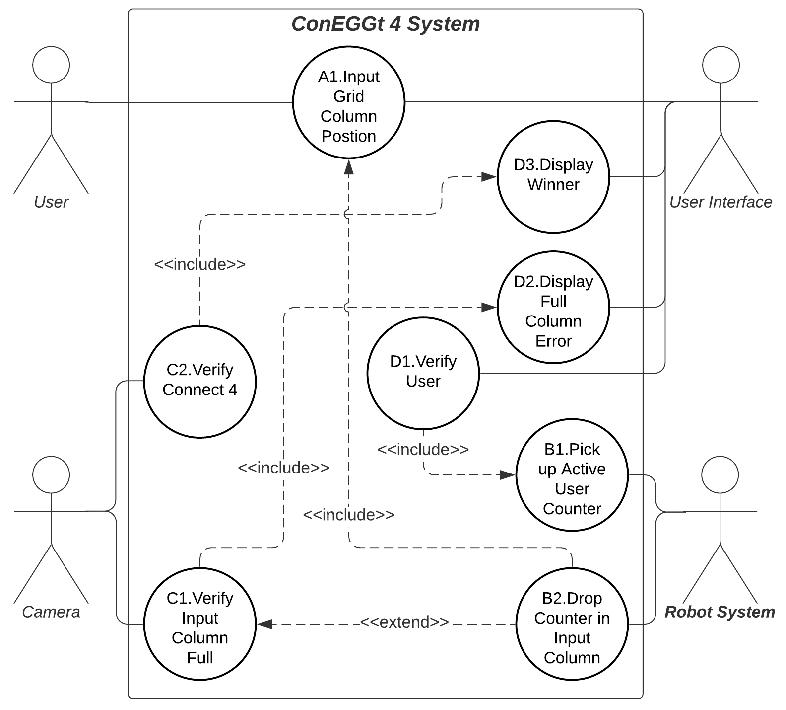

### Requirement Analysis
The following Use Case Diagram outlines the requirements assigned towards the “ConnEEGt 4” project. Each requirement is defined as a Use Case and is connected to a system element it impacts or is impacted by. The system elements, also known as actors, include the one of the two players as the active user, the visual aide camera, an active user interface and the robot system consisting of a UR5e collaborative robot, stored game counters and the game grid. Use cases connected by an "include" branch must both act simultaneously whereas Use cases that connect with an "extend" branch may be affected to those they are connected to.
  

  
Each Requirement Use Case is further detailed below.

| Use Case ID | User Case | Actors | Precondition | Active Scenario | Alternate Scenario(s) | Post Condition |
|-------------|-----------|--------|--------------|-----------------|-----------------------|----------------|
| **A1** | **Input Grid Placement** | Active User, User Interface | System waiting for input |Once the system is turned on, the active user can use the User Interface to choose the grid column they wish to drop their coloured counter | None | The active user has chosen their wanted position for their counter |
|**B1**| **Pick up User Counter** | Robot System | Use case **D1** identifies active user | Robot system grabs counter from corresponding player storage area with vacuum gripper |None| Robot has user counter and is ready to drop |
|**B2**| **Drop Counter in Input Column** | Robot System | Use Case **A1** gives input, Use Case **C1** is inactive| Robot will move to provided Grid column and drop active user counter | If Use Case **C1** is active, robot will not drop within input Grid Column | User counter has been dropped in provided grid column|
|**C1**| **Verify Full Column** | Camera | Input column chosen has all rows filled | Camera will send signal to UI to initiate Use Case **D2** |None| Column has been identified as full by system|
|**C2**| **Verify Connect 4** |Camera| Four of one user’s counters are aligned either vertically, horizontally, or diagonally | Camera sends signal to UI to initiate Use Case **D3** |None| Connect 4 has been identified by the system|
|**D1**| **Verify User** | User Interface | System is turned on and being played | Once the system has started, the UI will verify player one as the active user| After the first turn, the system will alternate between players as the active user after the Drop Counter use case has occurred | Current player is identified as active user |
|**D2**| **Display Full Column Error** | User Interface | Use Case **C1** is active| User Interface will display and Error message and tell User to choose different input column |None| User reads error message and proceeds to choose another grid column|
|**D3**| **Display Winner** |User Interface| Use Case **C2** is active | User Interface displays message announcing active user as winner, completing the game| None | Game has concluded and system shuts down|