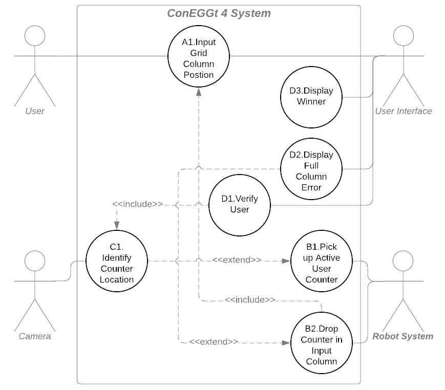

# Requirements and Specifications

ARMEE's newest project ConEGGt 4 is an automated robotic arm playing connect 4 from a users input of where to play each move. To complete this goal the project must follw a strict set of requirements and specifications to be able to play the game correctly. Firstly a set of technical terms and predefined locations specific to this project are outlined as they are required for this system to work. 

**Technical Terms**
*    The Red and Yellow pieces of the connect four game will be referred to as 'Counters'
*    The Blue 6x7 Connect Four board will be referred to as 'The Grid'
*    'The Grid' is made up of 6 rows and 7 columns
*    The end effector of the robot for this project is a vacuum gripper
*    The predefined spaces next to the robot where 'Counters' will be stored, will be known as 'Storage areas'. 

**Predefined Locations:**
 *  Two 'Storage areas' will be located on either side of the robot base, one for red counters and one for yellow counters.
 *  The Storage areas will be pre-located to maximise ease of access by the robot
 *   Counters in storage areas will be stacked on top of each other in a similar way to pancakes for ease of palletization.
 *   The Camera will be positioned such that it may record the entire board and all moves made by the robot.
 *   The Camera will relay its visuals to the users.
 *  The Drop location is a predefined location, defined relative to the Grid, above each of the columns from which the counters will be dropped. The Drop location is defined such that a counter released from the TCP should fall into the column of the Grid that the Drop location is defined relative to.
 *  The Pick up location is a predefined location, defined relative to the Storage area, above each of the counter stacks from which the counters will be picked up.
 
**Robot Functionality Breakdown:**
Input: User Command (Column from 0-6).
1. Relate Command to a column to a predefined position
2. Determine if it is red or yellow's turn (red goes first)
3. Move to yellow storage area (if even turn) or to red storage area (if odd turn)
4. Move down and grip counter using the end effector (Vacuum gripper)
5. Move the end effector to the position of the user defined column position
6. Drop the counter into the user defined column
7. Return to home position
Output: Counter placed in Column (defined by User input of 0-6).

### Requirement Analysis
The following Use Case Diagram outlines the requirements assigned towards the “ConnEEGt 4” project. Each requirement is defined as a Use Case and is connected to a system element it impacts or is impacted by. The system elements, also known as actors, include the one of the two players as the active user, the visual aide camera, an active user interface and the virtual robot system consisting of a UR5e collaborative robot, stored game counters and the game grid. Use cases connected by an "include" branch must both act simultaneously whereas Use cases that connect with an "extend" branch may be affected to those they are connected to.
  

  
Each Requirement Use Case is further detailed below.

| Use Case ID | User Case | Actors | Precondition | Active Scenario | Alternate Scenario(s) | Post Condition |
|-------------|-----------|--------|--------------|-----------------|-----------------------|----------------|
| **A1** | **Input Grid Placement** | Active User, User Interface | System waiting for input |Once the system is turned on, the active user can use the User Interface to choose the grid column they wish to drop their coloured counter | None | The active user has chosen their wanted position for their counter |
 |**B1**| **Pick up User Counter** | Robot System | Use case **C1** identifies counter location | Robot system grabs players counter from storage area based on location given by Use Case **C1** |None| Robot has user counter and is ready to drop |
|**B2**| **Drop Counter in Input Column** | Robot System | Use Case **A1** gives input, Use Case **D2** is inactive| Robot will move to provided Grid column and drop active user counter | If Use Case **D2** is active, robot will not drop within input Grid Column | User counter has been dropped in provided grid column|
|**C1**| **Identify Counter Location** | Camera | Use Case **D1** identifies active player | Camera identifies location of active users counter from storage space |None| Counter loaction identified for Use Case **B1** to use|
|**D1**| **Verify User** | User Interface | System is turned on and being played | Once the system has started, the UI will verify player one as the active user| After the first turn, the system will alternate between players as the active user after the Drop Counter use case has occurred | Current player is identified as active user |
|**D2**| **Display Full Column Error** | User Interface | UI column appears to be full| User Interface will display and Error message and tell User to choose different input column |None| User reads error message and proceeds to choose another grid column|
|**D3**| **Display Winner** |User Interface| UI identifies Connect 4 | User Interface displays message announcing active user as winner, completing the game| None | Game has concluded and system shuts down|

### Specifications

The ConnEGGt 4 project requires a robotic arm to be able to virtually play connect four from a users input of where to place counters on the grid. For this project a unique set of specifications are required to assure the robot is successfully completing each task involved in playing connect four.

1. Limb Actuation:
The robot's workspace must include the grid and playing counters, for the arm to be able to reach and interact with them for the game to be played. Additionally the TCP must be able to rotate each counter and position it correctly over the playing grid.

2. Camera/Visualisation: 
A camera must be placed to relay a visual to the users of the grid and each move made by the robot. The robotic arm must also be aware of the grid and counter position before starting the game as the camera will not relay this information to the robot.

3. Picking up Counters:
The vacuum gripper must be able to position itself over the stack of counters in their predefined location. Then it must pick up a single counter at a time without knocking over the stack of counters or moving them from their position. 

4. Dropping counters: 
The counter must be raised above the grid and positioned over the column that a user input to be played. The vacuum gripper should drop the counter into the correct grid column for the users turn.

5. User Input:
 The user must input a positive integer from 1 to 7  that must correctly be interpreted as the corresponding playing column on the grid for each move.

6. The virtual grid and counters must be in reach of the robot arm. The grid must be 360x485mm with counters 45mm in diameter for each grid space 

 These specifications are required to assure the connect four game is being played correctly and the system is fulfilling all of its tasks for each move in the game. If any of these are functioning incorrectly each move could be wrong and the game could not be played.

### Test Plan
Documents the procedures used to evaluate performance of the project solution against the project specifications. At the end of the term the team will document the test results and these should show to what degree the project specifications have been met.

**Testing Types**
1. Limb Actuation Accuracy Testing:
* 1.1a The Testing Plan* includes attaching a 'counter' to the TCP of the gripper and monitoring the robot's movement from the Storage area to the Drop location (see the definition for the Drop location). The TCP's final orientation and position relative to the top of the column and the Drop location is recorded, specifically whether the TCP is correctly rotated so the Counter is positioned directly above the desired column. This action is repeated 50 times.
* 1.1b The Acceptance criteria* for this test plan is that the average orientation and position of the counter differs from the Drop location and orientation by no more than 3mm. If the TCP position conforms to the Drop location parameters but is visibly not aligned with the top of the desired column of the grid, this test is considered a failure and the Drop position must be redefined.

2. Camera/Visual testing:
* 2.1a The Testing Plan* includes timing the image refresh over ten minutes and taking the average-minimum refresh time to ensure the camera is relaying information to the players at a rate that allows them to observe the board and the moves being made. 
* 2.1b The Acceptance criteria* for this test plan is an average image refresh rate that is < 15 Hz. If the average image refresh time is greater than 15 Hz, this is considered a failure and a new camera will have to be sourced.
* 2.2a The Testing plan* includes prompting the user for a move via the UI and monitoring the software values including the turn counter and desired column variables.
* 2.2b The Acceptance criteria* for this test plan is that the software passes all UNIT tests designed by the software engineers, the specifics of these UNIT tests are omitted from this report to ensure industrial espionage is minimised. If the UI fails to complete any of the UNIT tests it will be considered a failure and more debugging must be undergone.

3. Vaccuum Grip Testing - Counter Drop Testing:
* 3.1a The Testing plan* involves moving the robot to each of the Drop locations, with a Counter attached to the gripper, and dropping the counter 10 times into each column. The number if counters that failed to reach their desired destination will be tallied, this includes counters that land in their desired position and then bounce off.
* 3.2b The Acceptance criteria* for this test plan is 0 Counters failing to reach their desired position. If any counters fail to reach their destination, the Drop location dimensions will be revised. If counters travel to their desired position before bouncing into a different position that will also be considered a failure, however should multiple Counters experience this behavior the dimensions of the Grid itself will be revised.
        
4. Vacuum Grip Testing - Counter Pick Up Testing: 
* 4.1a The Testing plan* involves moving the robot to the pick up position, picking up a counter and holding it for 15 seconds. Remove the counter and repeat 50 times, tally all failed pick up actions including successful pick ups followed by immediate drops.
* 4.2b The Acceptance criteria* for this test plan is 0 Counters dropped and the position of the counter on the gripper never exceeding a 3mm radius around the TCP. Should any number of counters be dropped, the vacuum gripper will have to be reviewed and possibly replaced. Similarly if more than 5 counters are collected on the gripper outside the 3mm radius, that will be considered a failure and the palletising controller of the motion will have to be revised. If the gripper collides with the counter stacks in a destructive way that causes it to shift, topple or lose counters, that will also be considered a failure, in this case the robot path and pick up location will have to be revised.

5. Holistic Motion Testing:
* 5.1a The Testing plan* involves the combining of all components of the test plan, to input a column value, pick up a counter, move to the drop location and drop a counter into the user specified column. This test simulates the full range of motion and actions the final product will undertake, with the overall goal of having the robot play connect 4.
* 5.1b The Acceptance criteria* for this test plan is for the correct coloured counter to be picked up without issue, moved without violating safety constraints to the user specified drop location and dropped into the correct position. Any deviation visible or otherwise, from the full, correct operation of the robot will be considered a failure and the testing staff will categorise the source of the error and revise the appropriate sub-system. 
