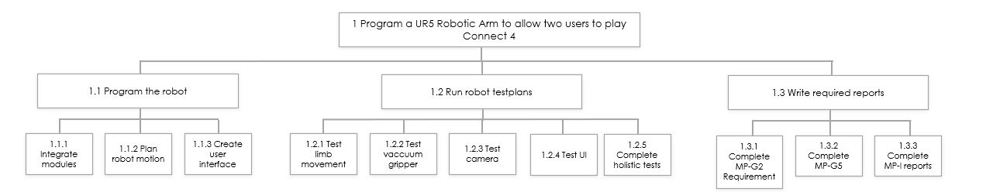

# Project Management Plan

### Project Scope
The scope of ARMEE's (Automatic Robotic Mobility Egg Egg) ConnEGGt 4 product involves the researching, planning, design, development and testing  of the UR5sim package. All project goals or tasks that cannot be completed by a standard UR5 arm robot are beyond the scope of this project. Non-Universal Robot attachments are excluded from this scope along with any modifications to the base software packages and changes to the overall functionality of the UR5 arm robot. The project also includes the completion of all documention, presentations, manuals and training aids to be used in conjunction with both the software and the hardware. Project completion will occur when the software can successfully fulfil the user specified task in a presentation setting through the use of the UR5 arm robot. All ARMEE project work will be completed internally without the outsourcing of any components. The scope of this project does not include any modifications to the user's operating system required to run the UR5Sim.

### Milestone and Deliverable List

The chart below lists the major milestones for the ConnEGGt 4. This chart is comprised only of major project milestones such as the completion of a project phases. Less significant milestones are not included on this chart. 

| Milestone | Description | Date |
|-----------|-------------|------|
| Complete research gathering| All requirements for DrawBot must be determined prior to the initial design| Completed Week 3 (20/06/2021)|
| Program movement of the ConnEGGT 4| Develop a software for the movemement of the hardware features| Completed Week 8 (24/07/2021)|
| Create the user interface of the ConnEGGT 4| Create the front-end interface that the user will use to operate our device| Completed Week 8 (24/07/2021)|
| Simulate the environment| Create the ConnEGGt 4 in ROS/Rviz, connect programmed robots to the simulations| Completed Week 8 (25/07/2021)|
| Test the limb movement| Design tests to move TCP from Pick Up location to Drop Off location and recording/verify results obtained| Completed Week 9 (1/08/2021)|
| Test vacuum gripper| Design tests to drop counters into appropriate grid columns and its ability to pick up counters from the Storage area whilst recording/verify results obtained| Completed Week 9 (1/08/2021)|
| Test cameara| Design tests to check correct refresh rates of cameras whilst recording/verify results obtained| Completed Week 10 (8/08/2021)|
| Test UI| Design a ease of use test for the user interface as a standard for testing| Completed Week 10 (8/08/2021)|
| Build virtual environment| Create the virtual model of the custom Connect 4 grid (including counters)| Completed Week 10 (8/08/2021)|
| Complete holistic tests| Design an overall test to verify gameplay component interface| Completed Week 11 (15/08/2021)|
| Completion of required reports| Completion of MP-G2, MP-G3, MP-I reports| Completed throughout|

### Change Management Plan

As a small company with five employees, it is important that everyone is aware of what changes are being made and when they happen as well as how each change will affect the system. We are able to reinforce this notion through our 5 step process for green-lighting any changes being made.

1. Identify The Need For Change:
As a team dicuss any improvements that need to be made and assign the task to an individual or multiple members to complete within an alotted time.

2. Evaluate Change:
Members involved in the task can evaluate if the change improves the function of the system and doesn't negatively impact other aspects of the system such as risk, cost and scope.

3. Complete And Test Changes:
Each individual will be making changes on their own copied version of the system in order to not affect the project until changes are accepted. Before the changes are accepted they will be tested to assure no bugs or faults in the code can affect other components of the system.

4. Submit Change Request:
After being satisfied with the changes they will be submitted to the team and at least one other member will review and test the code before the request is accepted.

5. Implement Change:
The change will be made to the project and all members will be sent a message describing how it alters the project and when it was done. Additionally, this change will be linked to this message if members want to review changes that have previously been made.

Through these steps the company is able to ensure all members are aware of any current changes to the system as well as how they are affected as they work on other aspects of the project.

### Communications Management

This plan outlines the primary methods of communication within the company throughout the project and are subject to change. This will be defined directly within the following Communications Matrix, outlining the reasoning and requirements of communication, as well as a code of conduct within these methods of communication. The Lead responsibility of certifying effective interaction within the company and towards stakeholders and the project sponsor will be a collaboration between the CEO and the CTO.

A guide on communication methods, participants and reasoning is defined in the Communications Matrix given below.

| Communication Type | Description | Frequency | Format | Participants | Deliverable | Owner |
|--------------------|-------------|-----------|--------|--------------|-------------|-------|
|Weekly Status Report|Summary of Project Status|Weekly|In Person|Project Sponsor,Team and Stakeholders|Status Report|CEO|
|Team Project Meeting|Meeting to analyse current project actions|Weekly|In Person|Team|Action Register|CTO|
|Milestone Review|Analyse how progress towards milestones|Fortnightly|Email/MS Teams|CTO and CEO|Progress Report|CEO|
|Direct Team Commmunication|Any communication needed between members|As Needed|Email/MS Teams/Informal|Team members|Direct Reply|CTO|

How these communication methods would be coordinated is defined in the following code of conduct.  
**Meetings**: a meeting agenda will be sent to participants the day before either through joint email or by the applicable Microsoft Teams page. A scribe will be responsible for timekeeping and recording relevant notes during the meeting to be further reviewed and acknowledged by participants. Attention to the topic at hand is required and possible distractions such as mobile phones or computer notifications should be removed.   
**Email**: Written emails should pertain to a professional standard when regards to the project. This includes a direct outline towards the associated work package, deliverable or team member ID and stating the subject or issue in a structured manner.  
**Informal Methods**: For direct, informal means of communication to other team members, it is advised that team members communicating long distance use formats defined within the  company such as Microsoft Teams chat, and not other third-party methods. If there any discrepancies, issues or concerns with project work or other team members, communication should be directed to the CTO .

Relevant team members and emails are provided below.

| Name | Email |
|------|-------|
|Chris Nguyen|c.n.nguyen@student.unsw.edu.au|
|Diane Muresan|d.muresan@unsw.edu.au|
|Sean O'shea|sean.oshea@student.unsw.edu.au|
|Jasper Seffrin|j.seffrin@student.unsw.edu.au|
|Daven Lau|daven.lau@student.unsw.edu.au|
|Samson Banzi|s.banzi@student.unsw.edu.au|

###  Scope Management Plan
The Scope Management plan defines the specific scope of the project and what the team is trying to achieve. 
It defines the processes used to define, verify and change the scope.

The Scope of ARMEE's product involves the researching, modifying and testing of the UR5sim package. T
The research scope of the project primarily includes the understanding of the limits and capabilities of the UR5 and its simulation package. Any and all project goals or tasks that cannot be completed by a standard UR5 are out of the scope of this project.
The modification scope of the project will focus on minor adjustments that can be made to the UR5 such as choice of end-effectors. Non-Universal Robot attatchments are excluded from this scope along with any modifications to the base software packages and changes to the overall functionality of the UR5. 
The testing scope of the product is the most extensive, all tests pertaining to Australian Industry and Health Standards are included in the scope, along with significant user based testing.

The scope of the project also includes the completion of all documention, presentations, manuals and training aids to be used in conjunction with both the software and the hardware. 
Project completion will occur when the software can successfully manipulate the hardware to complete the user specified task in a presentation setting.
All ARMEE project work will be completed internally without the use of outsourcing in any way. 
The scope of this project does not include any modifications to the user's operating system required to run the UR5sim such as updates, downloads or revisions, nor does it include delivery, construction or purchasing of the UR5. 

### Schedule Management

The scheduling for the DrawBot Project will include structuring the identified milestones and deliverables listed above and developing the Specific Work Packages in order to achieve the deliverables. This will be primarily generated through Jira Software, which can be used to create an initial work period schedule to be estimated. Once work package relationships and significance is defined, they will be ordered and assigned duration periods to be worked on within a preliminary schedule. Work packages may also be assigned attributing resources once resource estimation is complete.

Once the preliminary schedule is defined, it will be reviewed through the project team structure, starting with the Chief Executive Officer and Chief Technology Officer. Once they are in agreement of the work package structure and resource allocation, the schedule will be analysed by the other members in both the business team and the technical team. Once any conflicts raised are dealt with, if any, the baseline schedule will be sent to the project sponsor for final approval.

Through the continually developed schedule, set milestones developed by the company will be assigned, including:
  * Creation and approval of baseline schedule
  * Approval of member roles and responsibilities
  * Approval of resource allocation and budget
  * Project commencement
  * Confirmation and verification of milestone achievement
  * Approval and acceptance of final deliverables achievement

In terms of schedule development, the CTO will be responsible with developing work package tasks, duration and resource application, as well as scheduling through the Jira software. The CEO will then collaborate on validating budgeting, resource allocation and deadlines proposed, as well as be the direct communication line to the project sponsor and stakeholders. Members of the business team will assist the CEO in assessing the sustainability of the schedule elements, whereas members of the technical team will confirm the roles and work packages developed for them. The project sponsor and stakeholders will be involved in reviewing and approving the structure, budget and deadline of the schedule, directing any concerns to the CEO.

### Quality Management Plan

To assure that a high quality is maintained by ARMEE's innovative robot arm solutions, each project undertaken must adhere to strict quality standards assigned by the company CTO.

The quality standards will differ for each project or task required, although they must be completed and reviewed as acceptable by the CTO before the project begins. This is neccessary to help guide each individual as they work on the project.

Before being tasked each member will be given the unique quality standards expected of the final project and will refer to these quality standards for each change they make to the project, as well as when approving other individual's changes. This helps in assuring a high quality of work is kept while working on the project.

After the project is completed the CTO will test that the project fulfills the required quality standards and either approves or rejects the work depending on its quality. This assures that a high quality of work is achieved at all stages prior to the end of the project.

###  Risk Management Plan
The Risk Managment Plan involves the processes used to locate, identify and manage project risks.

ARMEE's approach to risk management is a proactive model involving the identification, categorisation and ranking of the various risks involved in the Drawbot project. The identification of risks will predominantly take place before any hardware is used, drawing together data from both UR5 manuals and Australian Standards to compile a risk portfolio for the Drawbot project.
This portfolio will rank and categorise all risk items and allows for the majority of risk mitigation strategies to be implemented before any testing occurs, thus allowing for the most prominent risk items to be added to the project schedule and assigned to risk management staff such that these risk mitigation strategies can be implemented at a set time in the project schedule.
Risk Management staff will monitor and assess the highest impact risk items, providing updates and recommendations throughout the project timeline as these risk items increase or decrease in impact level. 
The risk management plan also includes the allocation of one staff member as the emergency officer, this team member will be charged with any and all emergency procedures including first aid and emergency contacts. This team member must be present for all testing scenarios and any other project environments with high risk items.

### Organisational Structure

ARMEE \(Automatic Robotic Mobility Egg Egg\) is a small tech start up that specialises in providing innovative robot arm solutions for our clients.
The flexibility of the start-up structure is ideal for our needs as it means the company can adapt quickly to both internal and external changes and can tolerate workforce movement if employees are required to work across teams and areas. Our organisation structure will therefore be quite simple, consisting of the Chief Executive Officer, Chief Technology Officer and two teams \(Technical Team and Business Team\) as can be seen in the figure below. 

The legal structure of the company is a General Partnership between the CEO and CTO who are setting up the business as a shared project. The formalities required for this are creating an ABN and registering the business name. It does not need to be incorporated and there are no corporate paperwork requirements.

### Staffing Management Plan

The company is quite small and consists of five employees.

The role of the CEO will be to act as the general manager of the company which will involve ensuring the company fulfills its legal obligations, liaising with clients, coordinating sales, supervising the CTO and communicating with suppliers. They will also manage the Business Team of the company which consists of a business graduate that will assist the CEO with their duties.
The CTO will be responsible for the technical development of the robotic arm solutions. They will have to analyse the requirements of each client and work with the Technical Team to design and implement an innovative engineering solution. The technical teams consists of two Mechatronic and/or Software Engineers with at least a Bachelor of Engineering degree.

### Technical Terms
*    The Red and Yellow pieces of the connect four game will be referred to as 'Counters'
*    The Blue 6x7 Connect Four board will be referred to as 'The Grid'
*    'The Grid' is made up of 6 rows and 7 columns
*    The end effector of the robot for this project is a vaccuum gripper
*    The predefined spaces next to the robot where 'Counters' will be stored, will be known as 'Storage areas'. 

### Predefined Locations:
 *  Two 'Storage areas' will be located on either side of the robot base, one for red counters and one for yellow counters.
 *  The Storage areas will be pre-located to maximise ease of access by the robot
 *   Counters in storage areas will be stacked on top of eachother in a similar way to pancakes for ease of palletization.
 *   The Camera will be positioned such that it may record the entire board and all moves made by the robot.
 *   The Camera will relay its visuals to the users.
 *  The Drop location is a predefined location, defined relative to the Grid, above each of the columns from which the counters will be dropped. The Drop location is defined such that a counter released from the TCP should fall into the column of the Grid that the Drop location is defined relative to.
 *  The Pick up location is a predefined location, defined relative to the Storage area, above each of the counter stacks from which the counters will be picked up.
 
### Robot Functionality Breakdown:
Input: User Command (Column from 0-6).
1. Relate Command to a column to a predefined position
2. Determine if it is red or yellow's turn (yellow goes first)
3. Move to yellow storage area (if even turn) or to red storage area (if odd turn)
4. Move down and grip counter using the end effector (Vaccuum gripper)
5. Move the end effector to the position of the user defined column position
6. Drop the counter into the user defined column
7. Return to home position
Output: Counter placed in Column (defined by User input of 0-6).

### Work Breakdown Structure

We have broken down our project into tasks and subtasks which must be completed. The higher level tasks can be found below in the Work Breakdown Structure. The subtasks belonging to these high level tasks are listed below in the Gantt chart

### Baseline Schedule

Using a Gantt Chart structure, the tasks were scheduled and assigned to a team member as in the figure below.

